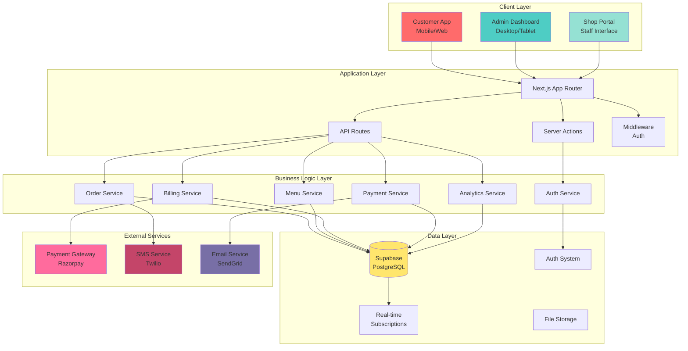
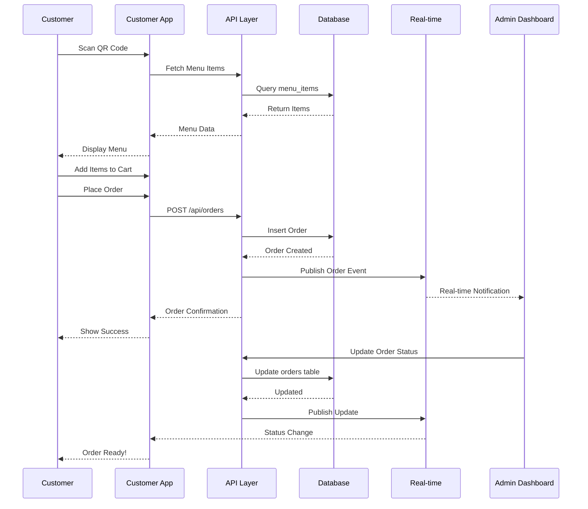
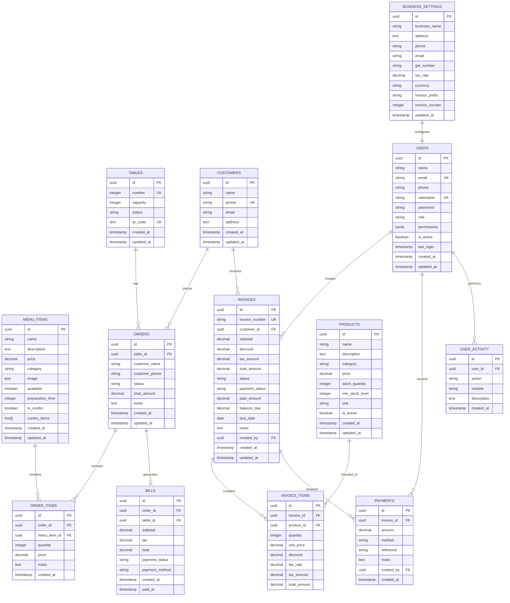
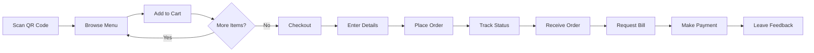
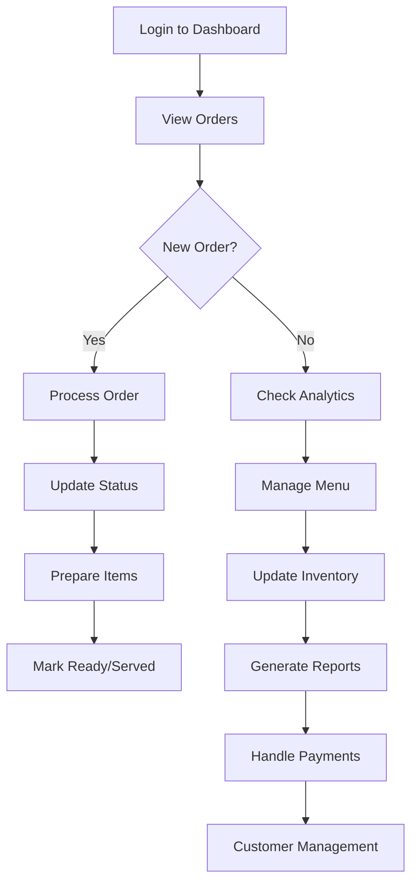
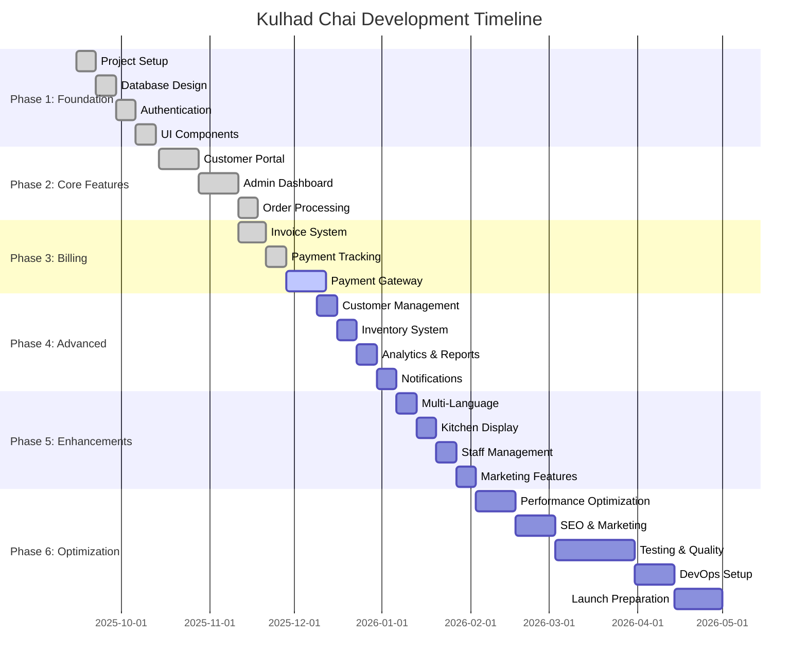
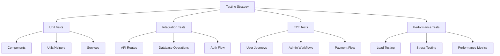

# 🍵 Kulhad Chai - Restaurant Management System

> **Status**: ✅ Production Ready | **Build**: Passing | **Security**: 95/100 | **Last Updated**: Oct 28, 2025

## 🎨 New Features

- ✨ **Stunning ColorBends Background** - WebGL-powered animated gradient on home page
- 🔒 **Enhanced Security** - Comprehensive security headers and hardened authentication
- 📚 **Complete Documentation** - Organized `/docs` folder with setup, architecture, and troubleshooting guides
- 🐛 **Bug Fixes** - Resolved infinite re-render issues for stable performance
- 🎭 **Premium UI** - Glass morphism effects with theme-matched styling

---

## 📋 Table of Contents

- [Overview](#overview)
- [Quick Start](#quick-start)
- [Features](#features)
- [Documentation](#documentation)
- [Tech Stack](#tech-stack)
- [Installation](#installation)
- [Deployment](#deployment)
- [Contributing](#contributing)

---

## 🎯 Overview

**Kulhad Chai** is a modern, full-featured restaurant management platform designed for small to medium-sized food establishments. It provides:

- **Customer-Facing**: QR code-based ordering with stunning animated UI
- **Admin Dashboard**: Complete business management suite
- **Billing System**: Automated invoice generation and payment tracking
- **Analytics**: Real-time reporting and insights
- **Multi-User Support**: Role-based access control (Admin, Manager, Staff)
- **Security**: Enterprise-grade security with comprehensive protections

---

## 🚀 Quick Start

```bash
# Clone repository
git clone <repository-url>
cd kulhad-chai-booking

# Install dependencies
pnpm install

# Setup environment
cp .env.example .env.local
# Add your Supabase credentials

# Run development server
pnpm dev
```

Visit `http://localhost:3000` to see the app with the stunning ColorBends background!

📚 **Full Setup Guide**: See [docs/setup/installation.md](./docs/setup/installation.md)

---

## 📚 Documentation

All documentation is now organized in the `/docs` folder:

- **Setup Guides**: [docs/setup/](./docs/setup/) - Installation, configuration, admin creation
- **Architecture**: [docs/architecture/](./docs/architecture/) - System design, database schema, auth flow
- **Features**: [docs/features/](./docs/features/) - Detailed feature documentation
- **Deployment**: [docs/deployment/](./docs/deployment/) - Security checklist, QA guide
- **Troubleshooting**: [docs/troubleshooting/](./docs/troubleshooting/) - Common issues and fixes

📖 **Start Here**: [docs/README.md](./docs/README.md)

---

## ✨ Features

### 🛒 Customer Portal
- ✅ **Animated ColorBends Background** - WebGL-powered gradient animation
- ✅ **QR Code Menu Access** - Scan table QR codes for instant menu access
- ✅ **Real-time Menu Browsing** - Category-based filtering with images
- ✅ **Glass Morphism UI** - Premium design with backdrop blur effects
- ✅ **Shopping Cart** - Add/remove items with quantity management
- ✅ **Order Placement** - Submit orders with customer details
- ✅ **Order Tracking** - Real-time status updates
- ✅ **Mobile Responsive** - Optimized for all devices

### 🎛️ Admin Dashboard
- ✅ **Order Management** - View and manage all orders in real-time
- ✅ **Menu Management** - Add, edit, remove menu items
- ✅ **Table Management** - Configure tables and QR codes
- ✅ **Customer Management** - Track customer data and history
- ✅ **Product Inventory** - Stock tracking and low stock alerts
- ✅ **User Management** - Multi-user roles and permissions
- ✅ **Analytics Dashboard** - Revenue, orders, and trends
- ✅ **Settings** - Business configuration and customization

### 💳 Billing & Payments
- ✅ **Invoice Generation** - Automated billing with tax calculation
- ✅ **Multiple Payment Methods** - Cash, Card, UPI, Credit
- ✅ **Payment Tracking** - Record and track all transactions
- ✅ **Partial Payments** - Support for installment payments
- ✅ **Bill Printing** - Thermal/regular printer support
- ✅ **GST/Tax Management** - Configurable tax rates

### 📊 Reporting & Analytics
- ✅ **Sales Reports** - Daily, weekly, monthly analytics
- ✅ **Revenue Tracking** - Real-time revenue monitoring
- ✅ **Popular Items** - Best-selling products analysis
- ✅ **Table Utilization** - Occupancy and efficiency metrics
- ✅ **Customer Insights** - Purchase history and patterns
- ✅ **Export Reports** - PDF and CSV export capabilities

---

## 🛠️ Tech Stack

### Frontend
```yaml
Framework: Next.js 14 (React 18)
Language: TypeScript
Styling: TailwindCSS 4.x
UI Components: Radix UI + shadcn/ui
State Management: React Hooks + Context API
Forms: React Hook Form + Zod Validation
Charts: Recharts
Icons: Lucide React
Animations: Tailwind Animate + Framer Motion
```

### Backend
```yaml
Runtime: Node.js
Framework: Next.js API Routes
Database: PostgreSQL (Supabase)
ORM: Supabase Client
Authentication: Supabase Auth
Real-time: Supabase Realtime Subscriptions
File Storage: Supabase Storage
```

### DevOps & Tools
```yaml
Package Manager: pnpm
Version Control: Git
Hosting: Vercel (Frontend) + Supabase (Backend)
Environment: .env.local
Code Quality: ESLint + TypeScript
```

### Third-Party Services
```yaml
QR Code Generation: qrcode.react
Date Handling: date-fns
Notifications: Sonner (Toast)
Analytics: Vercel Analytics
Email: Planned (SendGrid/Resend)
SMS: Planned (Twilio)
Payment Gateway: Planned (Razorpay/Stripe)
```

---

## 🏗️ Architecture

### System Architecture



### Application Flow



---

## 🗄️ Database Schema

### Entity Relationship Diagram



### Table Descriptions

| Table | Purpose | Records |
|-------|---------|---------|
| `menu_items` | Store all menu items with categories and pricing | ~50-200 |
| `tables` | Restaurant table configuration | ~10-50 |
| `orders` | Customer orders from all channels | Growing |
| `order_items` | Line items for each order | Growing |
| `bills` | Generated bills with payment status | Growing |
| `customers` | Customer database | Growing |
| `products` | Business product inventory | ~100-1000 |
| `invoices` | Business invoices | Growing |
| `invoice_items` | Invoice line items | Growing |
| `payments` | Payment transactions | Growing |
| `users` | Admin/staff users | ~5-50 |
| `user_activity` | Audit log | Growing |
| `business_settings` | Application configuration | 1 |

---


### Business Settings

Configure your restaurant details in Admin Dashboard → Settings:
- Business Name
- Address & Contact
- GST Number
- Tax Rates
- Currency
- Invoice Prefix

---

## 📱 Usage

### Customer Workflow



### Admin Workflow



---


## 📊 Development Roadmap

### Phase 1: Foundation ✅ (Completed)
**Timeline: Weeks 1-4**

- [x] Project Setup
  - [x] Initialize Next.js project with TypeScript
  - [x] Configure TailwindCSS
  - [x] Setup Supabase integration
  - [x] Environment configuration
  - [x] Git repository initialization

- [x] Database Design
  - [x] Design ER diagram
  - [x] Create migration scripts
  - [x] Setup tables and relationships
  - [x] Configure RLS policies
  - [x] Seed sample data

- [x] Authentication System
  - [x] Supabase Auth integration
  - [x] Admin login page
  - [x] Protected routes
  - [x] Role-based access control
  - [x] Session management

- [x] Basic UI Components
  - [x] Install shadcn/ui components
  - [x] Create reusable components
  - [x] Setup theme provider
  - [x] Mobile-responsive navbar
  - [x] Loading skeletons

### Phase 2: Core Features ✅ (Completed)
**Timeline: Weeks 5-8**

- [x] Customer Portal
  - [x] Menu browsing with categories
  - [x] Shopping cart functionality
  - [x] Order placement
  - [x] QR code integration
  - [x] Real-time order tracking

- [x] Admin Dashboard
  - [x] Dashboard overview
  - [x] Order management
  - [x] Menu management
  - [x] Table management
  - [x] Real-time notifications

- [x] Order Processing
  - [x] Order creation
  - [x] Status updates
  - [x] Real-time sync
  - [x] Order history
  - [x] Kitchen display

### Phase 3: Billing & Payments 🔄 (In Progress)
**Timeline: Weeks 9-12**

- [x] Invoice Generation
  - [x] Automated invoicing
  - [x] Tax calculation
  - [x] Discount management
  - [x] Custom bill templates
  - [x] Print functionality

- [x] Payment Tracking
  - [x] Record payments
  - [x] Multiple payment methods
  - [x] Partial payments
  - [x] Payment history
  - [x] Outstanding balance tracking

- [ ] Payment Gateway Integration 🚧
  - [ ] Razorpay setup
  - [ ] Online payment flow
  - [ ] Webhook handling
  - [ ] Refund management
  - [ ] Payment receipts

### Phase 4: Advanced Features 📋 (Planned)
**Timeline: Weeks 13-16**

- [ ] Customer Management
  - [ ] Customer profiles
  - [ ] Purchase history
  - [ ] Loyalty program
  - [ ] Customer preferences
  - [ ] Contact management

- [ ] Inventory Management
  - [ ] Stock tracking
  - [ ] Low stock alerts
  - [ ] Purchase orders
  - [ ] Supplier management
  - [ ] Stock reports

- [ ] Analytics & Reports
  - [ ] Sales reports
  - [ ] Revenue analytics
  - [ ] Popular items
  - [ ] Peak hours analysis
  - [ ] Staff performance
  - [ ] Export to PDF/Excel

- [ ] Notifications
  - [ ] SMS alerts
  - [ ] Email notifications
  - [ ] Push notifications
  - [ ] Order status updates
  - [ ] Payment reminders

### Phase 5: Enhancements 🎯 (Future)
**Timeline: Weeks 17-20**

- [ ] Multi-Language Support
  - [ ] i18n setup
  - [ ] English/Hindi/Regional
  - [ ] Dynamic translation
  - [ ] Language switcher

- [ ] Kitchen Display System
  - [ ] Dedicated kitchen view
  - [ ] Order queue
  - [ ] Timer management
  - [ ] Priority marking
  - [ ] Preparation tracking

- [ ] Staff Management
  - [ ] Employee profiles
  - [ ] Attendance tracking
  - [ ] Shift management
  - [ ] Performance metrics
  - [ ] Commission calculation

- [ ] Marketing Features
  - [ ] Promotional campaigns
  - [ ] Discount coupons
  - [ ] Referral system
  - [ ] Email marketing
  - [ ] SMS campaigns

### Phase 6: Optimization 🚀 (Future)
**Timeline: Weeks 21-24**

- [ ] Performance Optimization
  - [ ] Code splitting
  - [ ] Image optimization
  - [ ] Caching strategies
  - [ ] Database indexing
  - [ ] Query optimization

- [ ] SEO & Marketing
  - [ ] Meta tags
  - [ ] Sitemap
  - [ ] Social media integration
  - [ ] Google Analytics
  - [ ] Schema markup

- [ ] Testing & Quality
  - [ ] Unit tests
  - [ ] Integration tests
  - [ ] E2E tests
  - [ ] Performance testing
  - [ ] Security audit

- [ ] DevOps
  - [ ] CI/CD pipeline
  - [ ] Automated deployments
  - [ ] Monitoring & logging
  - [ ] Backup strategy
  - [ ] Disaster recovery

---

## 📈 Feature Progress



---


### Component Variants

| Component | Variants | Usage |
|-----------|----------|-------|
| Button | primary, secondary, outline, ghost, destructive | Actions, navigation |
| Badge | default, secondary, outline, destructive | Status, labels |
| Card | default, hover, interactive | Content containers |
| Input | default, error, disabled | Forms |
| Select | default, error | Dropdowns |
| Dialog | default, alert, confirm | Modals |

---

## 🔒 Security

### Implemented Security Measures

- ✅ Row Level Security (RLS) on Supabase
- ✅ JWT-based authentication
- ✅ Role-based access control (RBAC)
- ✅ Protected API routes
- ✅ Environment variable protection
- ✅ SQL injection prevention (parameterized queries)
- ✅ XSS protection (React sanitization)
- ✅ CSRF protection (SameSite cookies)

### Planned Security Features

- [ ] Two-factor authentication (2FA)
- [ ] Rate limiting
- [ ] API key rotation
- [ ] Audit logging
- [ ] Data encryption at rest
- [ ] Regular security audits
- [ ] Penetration testing

---

## 🧪 Testing

### Test Coverage Plan



